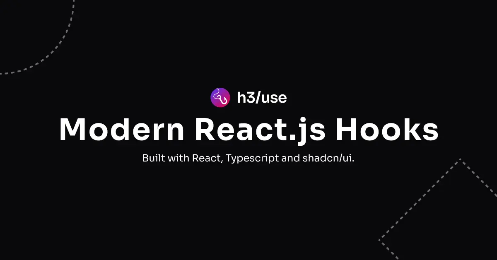

  
  

# guarahooks

A set of reusable and customizable hooks that you can copy-and-paste into your apps. Free. Open Source and Open Code.

## Documentation

Visit https://guarahooks.com to view the documentation.

## Contributing

Visit our [contributing guide](https://github.com/h3rmel/guarahooks/blob/main/CONTRIBUTING.md) to learn how to contribute. It only takes ~5 minutes to add an hook!

## Authors

## License

Licensed under the [MIT license](./LICENSE)
